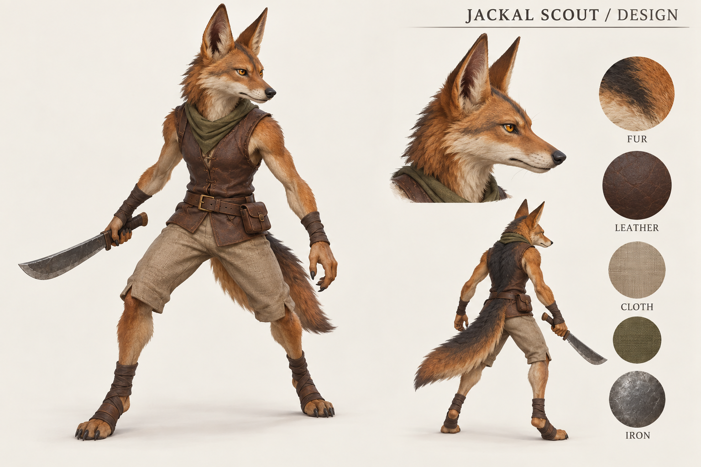
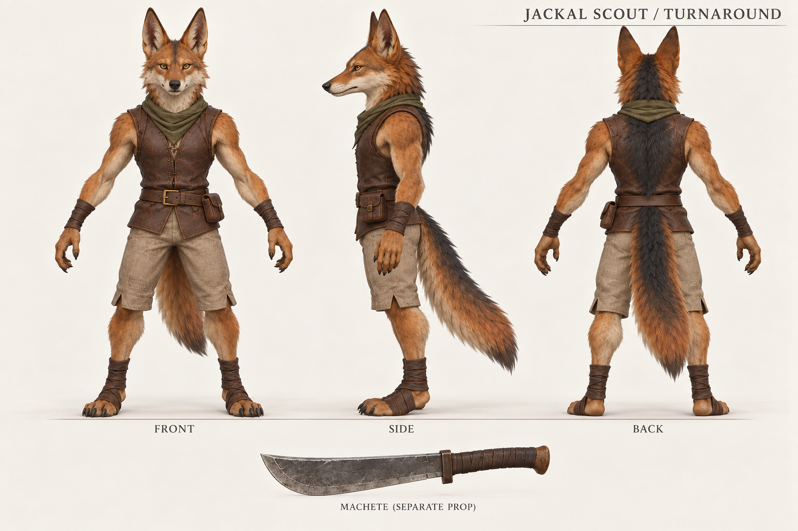
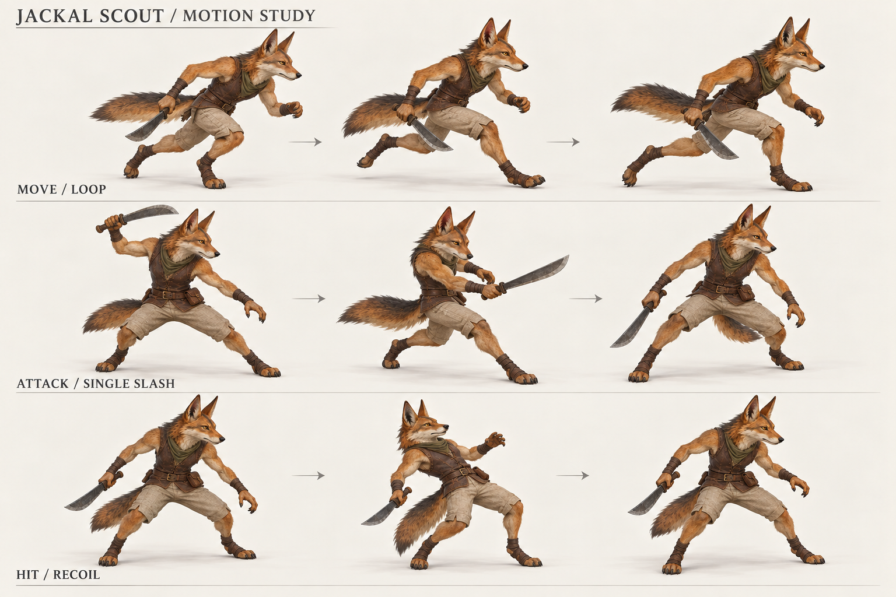

# 豺狼斥候：已确认参考图

2026-10-04。以下为已确认的 AI 造型与动作参考图。第一版 Blender 模型、骨骼和动画已制作完成，请打开[成品与动画预览](production/)，查看实际渲染和下载模型。成品尚未加入 Godot 代码。

## 1. 造型与材质

正常身材比例，长嘴、大耳、棕黄色毛色与黑背、简约皮背心、布裤、短刀。

## 2. 正面、侧面、背面

用于讨论比例、轮廓、服装及独立武器。概念图中的多视图并非精确的工程尺寸图，正式建模时需统一结构。

## 3. 移动、攻击、受击

跑动循环、单次挥刀、短暂受击回弹的静态姿态构想；这张图是概念参考，实际动画见[成品文件夹](production/)。

参考造型已获确认，模型和动画的后续反馈请以成品预览为准。

此文件夹仅供临时审阅。
