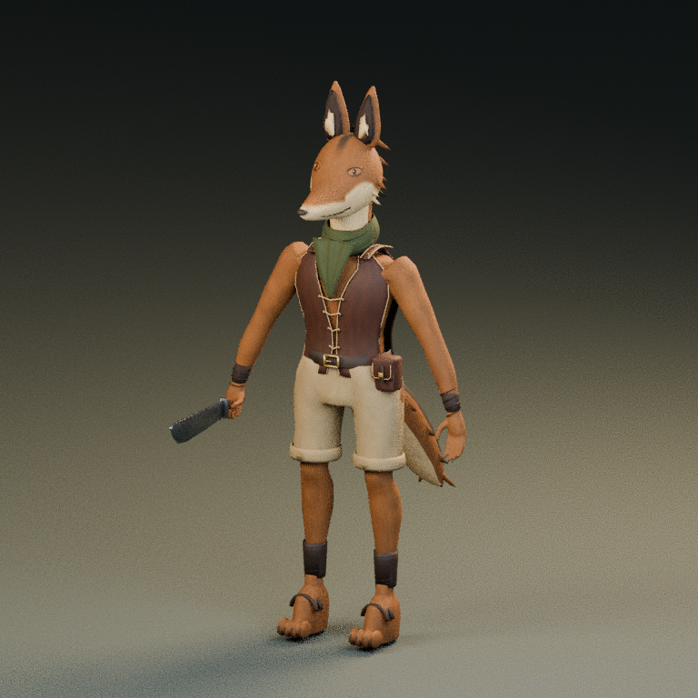
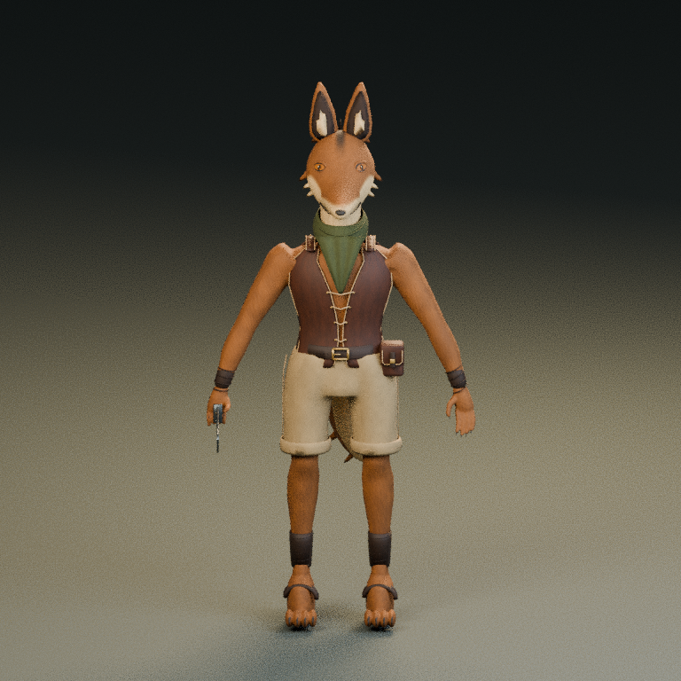
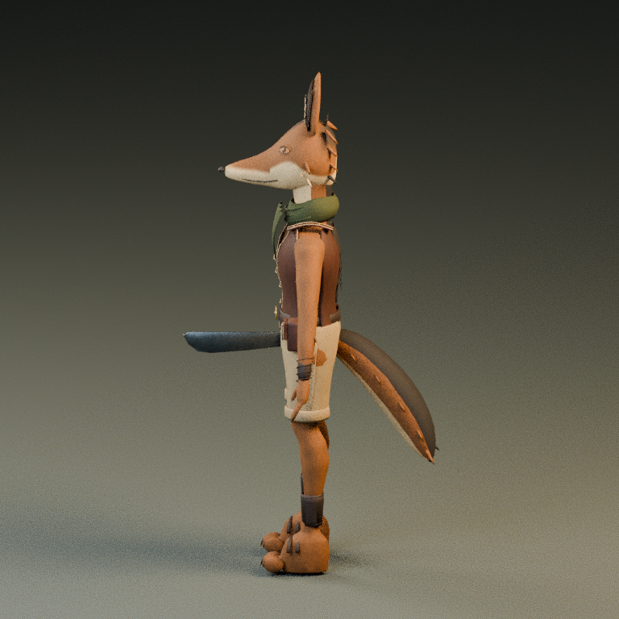
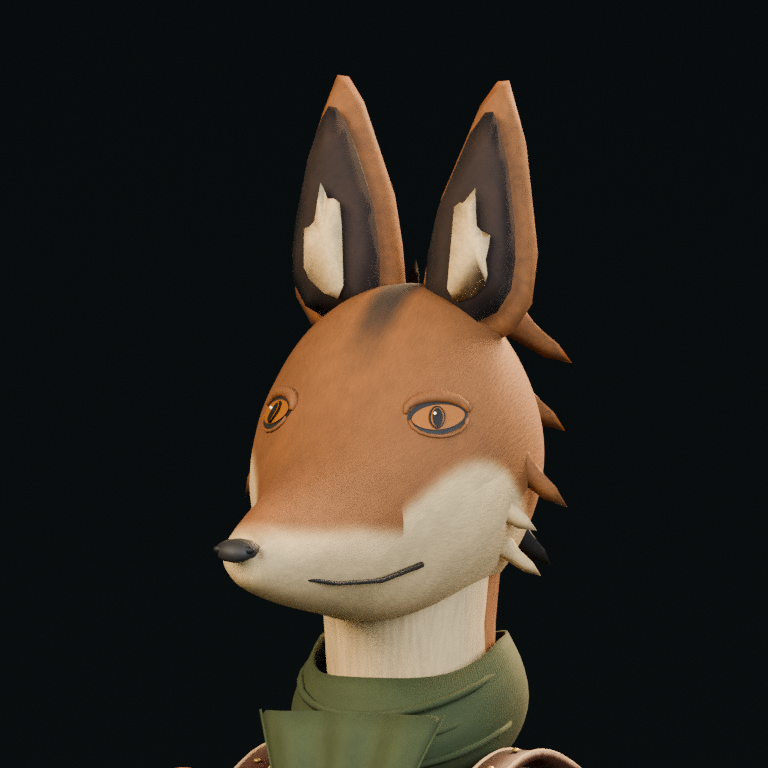

# 豺狼斥候：Blender 制作进度

这是按已确认参考制作的第一版实际 Blender 模型渲染，不是 AI 概念图。

**当前状态：模型与骨骼主体已完成，移动／攻击／受击动画仍在制作和检查；最终动画模型及视频尚未交付。**

使用 Blender 4.3.2 原生建模、蒙皮与关键帧流程。Tripo3D／Mixamo 当前无法从云环境访问，本次没有使用其在线服务。没有修改或接入 Godot 游戏代码。

## 模型预览

动画与导出完成后，本页会补上可下载成品和实际动画视频。
