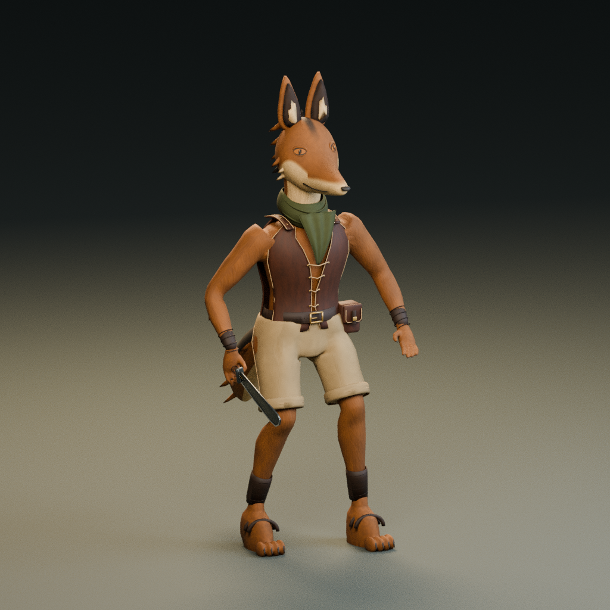
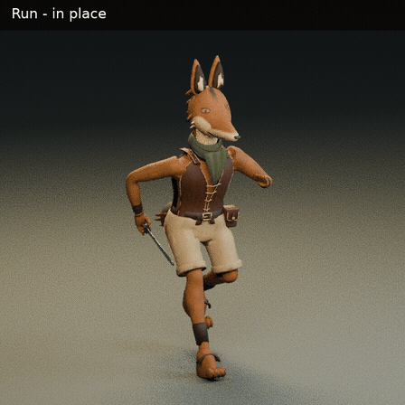

# 豺狼斥候：第一版模型与动画

2026-10-04。根据已确认的参考图，用 Blender 4.3.2 制作了可编辑模型、骨骼、蒙皮、贴图及四个实际动画。以下图片和视频均由这个模型渲染。当前是用于确认造型和动作的简化风格原型。



## 直接看动作

下面的 GIF 是半速预览，顺序为跑动、挥刀、受击；各段结束有短暂停留。



- [正常速度 MP4](https://raw.githubusercontent.com/niubi666-ui/little-panda-s-shop/main/temp-preview/jackal-scout-2026-10-04/production/previews/animation-preview.mp4)
- [半速 MP4](https://raw.githubusercontent.com/niubi666-ui/little-panda-s-shop/main/temp-preview/jackal-scout-2026-10-04/production/previews/animation-preview-slow.mp4)
- [动画姿态总览](previews/animation-pose-sheet.png)
- [移动姿态](previews/run.png) · [攻击姿态](previews/attack.png) · [受击姿态](previews/hit.png)

预览视频为 640 × 640、12 fps；GIF 为 448 × 448、6 fps。视频中动作时长经过采样取整，成品动画保留下面的精确时长。

## 下载成品

- [Blender 源文件：jackal-scout.blend，约 18 MB](https://raw.githubusercontent.com/niubi666-ui/little-panda-s-shop/main/temp-preview/jackal-scout-2026-10-04/production/jackal-scout.blend)
- [带骨骼、贴图和动画的 GLB：jackal-scout.glb，约 18 MB](https://raw.githubusercontent.com/niubi666-ui/little-panda-s-shop/main/temp-preview/jackal-scout-2026-10-04/production/jackal-scout.glb)

两份文件都内嵌贴图，可以单独下载使用。GLB 仅包含角色、右手短刀和动画；Blender 源文件另有摄影棚灯光、相机和地面。

| 动画名 | 时长 | 动作 |
| --- | ---: | --- |
| Idle | 3.00 秒 | 循环呼吸、重心微动、尾巴摆动 |
| Run | 0.80 秒 | 原地跑动循环 |
| Attack | 1.55 秒 | 右手单次挥刀；起手 0.75 秒、挥击 0.15 秒、恢复 0.65 秒 |
| Hit | 0.28 秒 | 非致死受击后仰与恢复 |

在 Blender 中选中 `JackalScout_Rig`，切换到 Action Editor，选择 `Idle`、`Run`、`Attack` 或 `Hit` 查看和修改。场景以 100 fps 制作，确保时长准确；NLA 轨道处于静音状态，用于保留动作，不会叠加干扰预览。打开文件时是待机姿态。

角色在 Blender 中朝 −Y，导出 GLB 后朝 +Z。根骨保持原位，单把短刀绑定于角色解剖意义上的右手 `Hand.R`，左手为空。

## 制作与检查

模型为 2 个蒙皮网格、50,524 个三角形、56 根骨骼、17 个材质及 17 张 1024 × 1024 贴图。源文件有 25,854 个加权顶点；GLB 因 UV 和材质边界拆点后为 33,583 个加权顶点。每顶点最多两个有效骨骼权重。

已检查实际蒙皮变形、权重归一化、右手武器跟随、循环首尾和四段动画的零起始时间。GLB 重新导入 Blender 检查通过，Godot 4.7.2 也能导入并播放四段动画；[检查报告](validation/)和[文件校验值](validation/checksums.json)随文件提供。报告中的 `jackal_scout_animated` 是导出时的文件名，与本目录改名后的成品内容一致。

本版未制作 LOD、面部动画或碰撞体，尚未验收多敌人同时显示的性能。外观和衣物细节仍可继续精修。这次环境无法访问 Tripo3D／Mixamo，实际制作采用 Blender 原生建模、绑定和关键帧。没有将成品加入 Godot 代码或游戏资源目录。

## 重建与复核

制作脚本和独立贴图在 [source/](source/)。使用 Blender 4.3.2，贴图脚本需要 Python 的 NumPy、Pillow。以下命令在 `production/source/` 下执行，生成文件留在本地：

```sh
mkdir -p previews
python make_textures.py
blender -b -t 3 --python-exit-code 1 --python build_jackal.py
blender -b -t 3 --python-exit-code 1 --python finalize_base.py
blender -b -t 2 --python-exit-code 1 --python animate_jackal.py -- \
  --source jackal_scout_base.blend --out ../rebuild --export
```

动画阶段会补正腰部、裤裆的蒙皮，并归一化权重。重建输出名为 `jackal_scout_animated.blend` 和 `jackal_scout_animated.glb`。检查重建结果：

```sh
blender -b -t 2 --python-exit-code 1 --python validate_animation.py -- \
  --blend ../rebuild/jackal_scout_animated.blend \
  --glb ../rebuild/jackal_scout_animated.glb \
  --out ../rebuild/validation_report.json
blender -b -t 2 --python-exit-code 1 --python roundtrip_glb.py -- \
  --glb ../rebuild/jackal_scout_animated.glb \
  --out ../rebuild/roundtrip_report.json
```

独立 GLB、Blender 和 Godot 检查脚本在 `source/checks/`；真实模型的静态渲染、动画帧及视频生成脚本在 `source/review/`。旧的 `model-front`、`model-profile`、`model-face` 图片是前期基础模型预览，最终效果以本页和带动画成品为准。

此文件夹仅供临时审阅。
