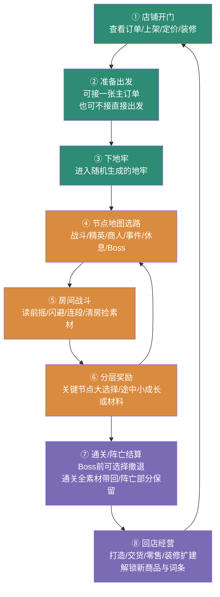

# 小熊猫的小店：项目玩法说明书（暂定名）

> 2026-10-02 文档入口提示：本文件保留玩法愿景/美术基准。当前实现与未完成项见 [交接](docs/HANDOFF.md)，最新工程约束见 [核心契约](PROJECT_CONTRACT.md)。按任务需要阅读，无需每轮全文载入。

> 本文件记录玩法设计；代码架构与开发约束以 [PROJECT_CONTRACT.md](PROJECT_CONTRACT.md) 为准。文中的数量和时长属于设计目标，实际可调参数在开发中外置配置。

**项目一句话**：玩家扮演一只小熊猫店长，经营杂货铺与小院，可从英雄们的订单中选择一张，也可自由下地牢打怪捡宝，用战利品供货、卖钱、装修和扩大小店。主角的名字由玩家在开局时自定义，不预设固定名字。

| 维度 | 设定 |
|---|---|
| 类型 | 俯视角 3D 动作肉鸽 + 店铺经营 |
| 平台 | Steam PC，买断制 |
| 玩家 | 单人 |
| 单局节奏 | 战斗约 70%、店铺约 30%；每局时长由可玩切片测定，营业与装修不强制计时 |
| 核心身份 | 既是冒险者也是店主：打怪和卖货互为因果，不是两个独立游戏 |
| 引擎/工具 | Godot 4 + Blender + GPT-6 Astra（Codex 对话框） |
| 语言 | 中英双语（本地化架构从第一天就绪） |
| 输入 | 键鼠为主（P0 只保键鼠），手柄架构预留后补 |

---

## 1. 核心承诺与支柱

**玩家承诺**：把"打怪捡来的东西"变成"店里卖得掉的东西"，再把小店越开越大；订单提供可选的明确目标，自由冒险也能探索、补货和积累成长。

| 支柱 | 规则与反例 |
|---|---|
| 自选冒险目标 | 多位顾客提供订单，玩家选择接 0 或 1 张主订单；也可以自由探索与补货。接单时来源信息应让选路有依据 |
| 战利品永远有用 | 任何掉落都能被打造、售卖或满足订单，没有"垃圾素材" |
| 战斗快速可读 | 怪物攻击前有明确信号，玩家用闪避与走位换取输出窗口。反例：无预告的突然伤害 |
| 店铺一眼看懂 | 主店与小院的功能区清晰，顾客、订单、货架容易查看；经营与装修共同提供长期成就感 |

**核心动词**：挥砍、闪避、捡拾、定价、接单、扩建。

---

## 2. 核心循环（三层）

```
瞬时层：读怪物前摇 → 闪避/连段 → 捡拾掉落 → 顿帧/震屏反馈
单局层：选择接单或自由冒险 → 节点选路 → 房间战斗 → 分层奖励与构筑 → Boss/撤退/阵亡结算
长期层：打造上架 → 卖钱扩建 → 解锁高阶订单 → 信誉与图纸成长
```

**循环一句话**：选择接单或自由下地牢 → 战斗与构筑 → 带回素材 → 打造、交货或上架卖钱 → 装修扩建与解锁 → 再下一局。

**跨层传递物**：
- 素材：地牢 → 店铺（打造原料）
- 金币：店铺 → 永久升级与扩建
- 图纸：订单 → 新商品与新词条
- 订单：店铺 → 可选的下一局目标
- 信誉：交货 → 顾客质量与订单档次

---

## 3. 玩法走读（一个完整循环）

清晨开店，柜台前站着一名圣骑士，头顶冒出一张订单："下次冒险帮我带一把火焰附魔的长剑，定金先付，交货还有图纸。"他走后，你扫了一眼货架——还差火焰元素素材。于是收起零钱，掀开柜台后的地窖盖板，下到店里唯一的"货源"：一座永远在变的地牢。

入口的节点地图亮出三条路：左边一排战斗房间通往火史莱姆巢穴，中间是商人房，右边一条岔路标着精英怪的骷髅。你选了左边——订单需要火焰素材，这一局的路线目标从第一秒就定了。

第一间房两只史莱姆。它们起跳前会先压扁蓄力，这是信号：你侧步闪开，落地后从背后连砍三刀，最后一下崩出顿帧和震屏，第一只炸开，掉出局内金币和一块火焰胶质。清房后获得一次小额数值成长与材料，选了普攻威力提升；关键构筑选择留在后续精英等节点。订单商品仍要靠带回素材后按配方打造。

后两间房遇到一只扛着木棒的哥布林和一只落单精英。精英把你逼到墙角，你抓住它攻击后的空隙解决了它，捡到一块稀有火核，并获得一次大的构筑选择，例如给特殊技装上爆炸核心。订单所需的打造配方在接取时已经明确，不把交货押在随机宝箱恰好开出图纸上。

回到店里已近黄昏。你在打造台把火核和剑胚合成火焰长剑，交给圣骑士，尾款落袋，信誉提升。多余战利品可以上架零售。金币的入账声响起，店门口亮出扩建选项：解锁一间锻造侧翼房。你点了确认，然后去看今天新挂出的订单——也可以暂时不接，下一局自由探索。

---

## 4. Game Flow



---

## 5. 核心机制

### 5.1 主角：小熊猫店长（名字由玩家自定义）

可爱小熊猫，身份是杂货铺店长。背景设定从简：不绑定任何阵营、前职业或人际关系，只有一件事成立——他开店多年，见过所有素材的行情。这一设定以局外被动"行情嗅觉"存在：玩家能提前看到素材的订单价值标签，把"捡到的东西值不值钱"变成每时每刻的判断。游戏内主角名称由玩家在开局时自行输入，不预设固定名字。

### 5.2 战斗

| 模块 | 规则 |
|---|---|
| 基础动作 | 剑为首版：左键三连击、右键点击重斩、Shift闪避；右键可改为剑气。具体取消、冷却和成长规则由配置与构筑方案定义 |
| 构筑归属 | 升级绑定具体动作或明确全局范围；每动作至多一个核心，另有形态、兼容支持和定向协同。本轮任务见[构筑方案](docs/BUILD_SYSTEM.md) |
| 打击感 | 顿帧、屏幕震动、击中闪光、粒子与音效四层叠加；手感优先级高于动画精度 |
| 敌人可读性 | 所有高威胁攻击都有前摇信号（蓄力、闪光、音效），玩家靠闪避与走位换取输出窗口；无预告秒杀不进入范围 |

### 5.3 地牢与节点选路

地牢由模块化房间拼接生成，房间之间用门连接，镜头为俯视角。单局采用《杀戮尖塔》式节点地图：每次通关一个节点，从 2–3 条分支选择下一步，不同分支通往不同房间类型。选路是单局最重要的策略决策，订单让选路有了方向。

| 房间类型 | 内容 |
|---|---|
| 战斗 | 若干波普通怪物，按配置给数值小选择或材料等奖励；不默认每房一次关键构筑 |
| 精英 | 强化敌人/遭遇，关键构筑选择的重要来源，可附稀有素材，风险收益并存 |
| 商人 | 局内商人，用本局金币购买词条、药水或素材 |
| 事件 | 抉择型事件（神秘商人的委托、奇怪祭坛、走失的货物），结果有得有失 |
| 休息 | 回复生命，或临时强化一项词条 |
| Boss | 阶段守关者与大选择节点；终局结束时奖励需有实际用途。出场/奖励/通关条件由路线配置决定 |

### 5.4 3 选 1 构筑（Build）

精英、Boss等关键节点提供大的构筑选择，整局暂按约8次规划；普通战斗途中另有数值小选择或材料奖励。两层奖励分别配置，八次不等于房间数，也不把全部小奖励算入。正式路线/结算尚未实现，详细边界见[路线与奖励](docs/contracts/ROOM_GENERATION.md)。以下为后续内容方向，不锁定最终流派与元素体系：

- **攻击行为与附加效果**：剑气、分裂、连锁、持续状态等；火焰 / 冰霜 / 毒素 / 雷电只是可讨论的表现与机制例子，不是必须实现的四条流派；
- **连段强化**：加段数、加范围、加攻速，服务近战爽感；
- **闪避与机动**：加闪避次数、闪避后强化、冲刺攻击；
- **掉落与店铺联动**：加素材掉率、特定素材掉落、局内售价提升——让"打怪"与"卖货"在构筑层面互相作用。

构筑只在单局内生效，结束清空；"完成订单"会把对应词条趋势反馈给局外（解锁更多同类词条进入池子）。

### 5.5 订单系统

订单是店铺与地牢之间的可选联系：多位顾客提供需求，玩家可接 0 或 1 张主订单。接单后有定向采集目标与额外报酬；无订单冒险仍可探索、补货和解锁。普通订单不决定全部收入上限。

| 订单档位 | 规则 |
|---|---|
| 普通订单 | 需求量大的常见商品，交货周期宽松，稳定收入来源 |
| 属性订单 | 指定元素或词缀（如"火焰长剑"），驱动选路与构筑，报酬更高 |
| 紧急订单 | 限一局内完成，报酬最高但失败扣信誉 |
| 传说订单 | 长线目标（收集整套素材），完成后改变店铺（新扩建档位或专属商品） |

订单结算：交付获得金币与图纸；未交付可退还定金但信誉下降。信誉决定顾客质量与订单池档次。

### 5.6 店铺经营

店铺是一栋可扩建主店加一块可装修小院，后续增加侧翼。经营功能集中，目标是"看得懂、上手快、越建越大"，同时能通过家具、装饰与战利品陈列体现玩家选择。

- **打造**：地牢素材 + 图纸的组合下制作商品（装备、药水、饰品）；
- **上架与摆放**：商品放上货架；货架、柜台与装饰在解锁区域中网格布置，小院可摆花坛、招牌、灯具和战利品；摆放需保留必要通道；
- **定价**：拖动价格条，顾客按价格区间给出反应（过贵离开、合理成交、过便宜抢购），不建模复杂供需；
- **顾客**：每次营业来 3–5 位英雄，携带随机需求；与订单系统互补（订单是预约，顾客是现场零售）；
- **扩建**：固定档位升级——路边摊 → 正式店铺 → 锻造侧翼房 → 储藏室 → 二层百货。每档解锁新图纸、新柜台与更多货架位。

明确不做：人流模拟、自由圈地建造、复杂供应链。

### 5.7 局外成长

| 货币 | 成长线 |
|---|---|
| 金币 | 购买永久升级（生命、闪避、初始装备、素材携带量） |
| 图纸 | 解锁新商品配方与新词条进池，扩大商品种类与构筑多样性 |
| 信誉 | 提升顾客质量、订单档次，解锁传说订单 |

### 5.8 敌人体系

中期原型暂以约 20 个敌人为内容目标，最终种类继续扩充。按三层产能策略组织：

- **换皮复用**：人形敌人共享一套骨架与动作模板，换模型、配色与攻击参数即成新敌人；
- **程序动画**：史莱姆、幽灵、漂浮怪不走路，用脚本做弹跳与浮动，零手工动画；
- **精英与 Boss**：精英是强化模板，Boss 单独制作 1 套演出级动作。

弱点、抗性与构筑克制关系待原型验证后确定，不以四种固定元素为前提。先确保敌人攻击前摇和高威胁行为可读，再逐步增加组合复杂度。

---

## 6. 内容结构

### 6.1 第一版地图原型：三幕验证路线

以下三幕用于第一版游戏原型验证主题切换、选路与难度推进；主题、顺序和 Boss 名称均可调整。它们不是最终内容上限，也不要求首个可玩闭环一次做完三幕。

| 幕 | 主题 | 内容特征 |
|---|---|---|
| 第一幕 | 废弃矿道（教学候选） | 低威胁敌人、基础词条、可跳过的订单引导；暂定 Boss 为矿道守卫 |
| 第二幕 | 腐化森林（主题候选） | 验证敌人配合、精英与商人房节奏；暂定 Boss 为腐化树灵，不绑定毒或自然流派 |
| 第三幕 | 地牢深处（本轮原型终点） | 验证高强度敌人组合与阶段结算；暂定 Boss 为远古守护者，不代表正式版最终 Boss |

### 6.2 中期原型内容目标（切片验证后逐步制作）

以下数量用于中期原型规划，不是首个闭环的最低要求，也不是正式版总量承诺。

- 敌人约 20 个（含 3 个 Boss、4 个程序动画型）；
- 词条约 60 个，覆盖经原型验证的若干构筑方向，具体主轴待设计；
- 商品约 30 种（装备、药水、饰品三类）；
- 订单约 40 条，分四档；
- 房间模块：每幕 1 套地砖套件，约 6 类房间模板；
- 店铺扩建 5 档。

### 6.3 长期内容方向

- 制作十几种不同的房间地图/布局模板，通过模块化生成形成路线；同一主题可以共享地砖、墙体、灯光与道具套件。
- 同一房间模板的小物品种类、位置、朝向与组合可以变化，同时保持整体风格、通路与战斗可读性。
- 最终 Boss 内容池目标为 5–6 种，普通敌人、商品、订单也将超过中期原型数量。单局出现几个 Boss、是否轮换及出场顺序另行设计，不默认每局必须打完全部 Boss。
- 主题数量、房间模板数量与装饰变体数量分别统计；十几种房间地图可以由若干共享美术主题支持，具体规模随制作验证调整。
- 当前先实现少量代表性内容，验证扩充接口与生产流程，再增加总量。

### 6.4 房间变化与深入难度：原型设计基线

将房间拆为布局模板、主题套件、装饰配置和遭遇配置。布局定义门、通道、战斗区与合法摆放区；装饰在规则允许的区域变化；遭遇定义怪物组合、波次和出生约束。路线生成和房间内部变化是两层独立流程。

难度随路线深入总体上升，休息房与局部缓冲仍可保留。使用路线节点明确的深度和房间类型计算本房难度，不按场景文件名或固定幕编号推断。重新进入或读档不会增加深度；本房进入后锁定难度，不因玩家刚拿到强词条临时追涨。

优先通过敌人配合、波次、精英比例与招式组合增加压力，辅以有上限的生命、伤害等数值曲线；怪物同时在场数量、出生距离和攻击预警需要限制。更高风险的奖励也要配套配置。

纯视觉小物品与影响碰撞、掩体、通路的物件分别生成。后者必须验证门口连通、玩家出生安全、怪物可达与攻击预警可见；装饰随机不能堵住门或关键交互。房间方案在进入前确定并保存，读档恢复同一方案。

---

## 7. 界面与操作

### 7.1 操作映射（键鼠为主）

| 操作 | 动作 |
|---|---|
| 移动 | WASD |
| 攻击 / 重击 | 鼠标左键连按连段，长按重击 |
| 闪避 | Shift |
| 技能 1 / 2 | Q / E |
| 交互 / 捡拾 | F（避免与技能 2 冲突，动作可重绑） |
| 经营操作 | 鼠标拖动为主：定价拖条、上架拖拽、摆放网格吸附 |

手柄 Input Map 架构预留，P0 不实现手柄 UI 焦点。

### 7.2 HUD 要点

- 地牢层：生命、体力（闪避次数）、当前订单目标（常驻角标）、本局 Build 摘要；
- 店铺层：今日顾客列表、订单板、金币与信誉、扩建按钮（可用时高亮）；
- 全局：素材"行情标签"（主角被动），掉落时直接显示订单价值。

---

## 8. 范围

### 8.1 P0（必须成立）

- 按 PROJECT_CONTRACT.md 的 M0–M4 逐步形成第一块完整可玩切片，先验证架构与闭环再铺内容；
- 战斗基础：近战、闪避、可读攻击预警，逐步接入重击与主动技能；
- 地牢基础：节点选路与少量模块化房间，验证波次、清房和返回；
- 构筑：三选一及覆盖攻击派生、投射物变化、状态/连锁等组合能力的最小词条集；具体用哪些主题效果验证可以调整；
- 店铺基础：打造、上架定价、顾客订单、主店与小院中的基础摆放；
- 闭环同时覆盖接单与不接单：下牢 → 结算 → 交货或零售 → 成长；
- 中英文、内容校验、存档与恢复贯穿实现，而非内容做完后补。

### 8.2 P1（内容扩展）

按中期原型目标逐步扩充词条、商品、事件房、订单与三幕验证内容，再发展十几种房间地图及更大的敌人/Boss内容池；图鉴与统计随需求补充。

### 8.3 非目标

多人联机、开放世界、自由建造、复杂经济模拟、写实人物比例、局外技能树之外的深度养成。场景使用人工制作的模块与布局模板，路线、合法摆放区内的物件及遭遇按配置组合生成。

---

## 9. 生产风险与验证

| 风险 | 应对 |
|---|---|
| 角色动画产能 | 俯视角 Q 版对动画精度要求低；Mixamo / AI 动捕打底，程序动画覆盖非人形；敌人换皮复用 |
| 画质 vs 产能 | 环境光影可借 AI 产线提升，角色与生物保持风格化；美术档位锁死，防止画质蠕变 |
| 战斗手感 | M1 先做完整战斗循环原型并掐表验证，手感不达标不进入内容铺量 |
| 内容量失控 | P0 范围冻结；素材/词条/敌人数量以"能做出并复用"为准，不做无限内容 |

验证门禁：
- 垂直切片：战斗之外，必须包含接单或自由出发、回店售卖/交货和存档，工程里程碑见 PROJECT_CONTRACT.md；
- 每两周一次真人试玩，检查订单是否提供有意义的选择，自由冒险是否同样成立；
- 每次内容新增前，确认能在现有产能节奏内完成，否则砍内容保闭环。

### 9.1 叙事与世界观原则

- 世界观背景从简：不做阵营设定、不做角色前史绑定，背景只是包装，不承担拉新；
- 叙事定位为调味料：地牢氛围可以有低密度喜剧对白（寒暄、吐槽），但一局不超过 1–2 次，不写大段剧情；
- 对话绑定玩法：NPC 对话必须附带玩法价值（透露房间布局、打折、订单线索），纯闲聊不投入；
- 不做 Hades/Undertale 级系统叙事（文本与配音成本在 5 个月周期内撑不住）；
- 事件文本随时可砍：试玩反馈差的内容直接删除，玩法零损伤。

---

## 10. 美术方向

场景画质与氛围基准见 [《美术方向基准》](美术方向基准.md)。店内、店外和森林普通战斗的目标图已选定；角色、特效与界面仍需动态实机验证。

- **整体方向**：高质感风格化奇幻 3D；场景构图、材质和光影以《美术方向基准》所列三张选定图片为目标，并通过 Godot 动态实机验收。
- **环境**：可信的 PBR 材质、暖冷光层次和清楚的游戏空间；贴花、湿材质与光束按场景需要选择使用。
- **角色与生物**：主角小熊猫单独采用 Q 版比例，其他角色和怪物默认保持正常身材比例；具体造型、动画和战斗可读性仍需实机验证。
- 主角：小熊猫店长，名字由玩家自定义。

---

## 11. 工程与协作约束

完整约束与实现路线见 [PROJECT_CONTRACT.md](PROJECT_CONTRACT.md)，自动读取入口为 [AGENTS.md](AGENTS.md)。

- Godot 4 + GDScript，Blender负责模型/动画整理；脚本、API与MCP辅助生产。
- JSON负责内容数值和翻译源；.tres/.tscn负责原生资源与场景。一个字段只有一个权威来源，缺配置报错，不写隐藏默认值。
- 使用有意义的场景、函数和数据ID；生成/修改场景后在引擎验证。
- 功能按模块组合，父级注入依赖；构筑执行、奖励抽取、持久结算有明确归属。
- 多人AI协作采用契约先行、文件单写者；允许直接沟通接口变化，不依赖某个长期会话一直打开。
- 兼容体型的人形敌人优先复用标准骨架/动作，特殊体型按实际需要处理；非人形可用程序动画。复用优先，但不强求所有敌人共享不合适的骨架。
- 资产生成和变体制作优先保存可重跑脚本；美术与战斗判定通过资源映射连接，替换模型不应重写战斗规则。
